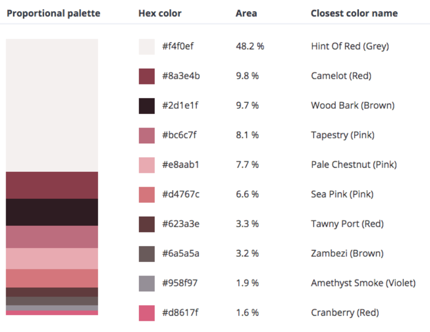

```{r setup, include=FALSE}
knitr::opts_chunk$set(echo = FALSE)
```

### Theme

The RStudio website has a [**Distill for R Markdown**](https://rstudio.github.io/distill/) article that I referred to often when I was creating my website. I had no clue when I started creating this website and I really wanted it to personalize it to my liking. I started with the [**Theming**](https://rstudio.github.io/distill/website.html#theming) section. I used the create_theme() function to create my personalized theme, called "courtney_theme.css". 

### Coloring 

It took me a long time to figure out what format the colors were in. I finally found that they are hex colors. Black is #000000, white is #FFFFFF, ad every other color is somewhere in between. I used a [**Hex to RGB Color Converter**](https://www.rapidtables.com/convert/color/hex-to-rgb.html) to get to the colors that I wanted for the background, headers, mouse hover, and font colors.

<center>

{width=75%}

</center>

### Font

Changing fonts on the website did not end up being too tricky. I also found instructions on how to change the default font on the [**Distill for R Markdown**](https://rstudio.github.io/distill/) article. First, I went to the [**Google Fonts**](https://fonts.google.com/) website. Then I searched for the ones that I liked. I chose three fonts that I thought looked nice together and imported them into my courtney_theme.css and then inserted them into my code where I wanted them. 
